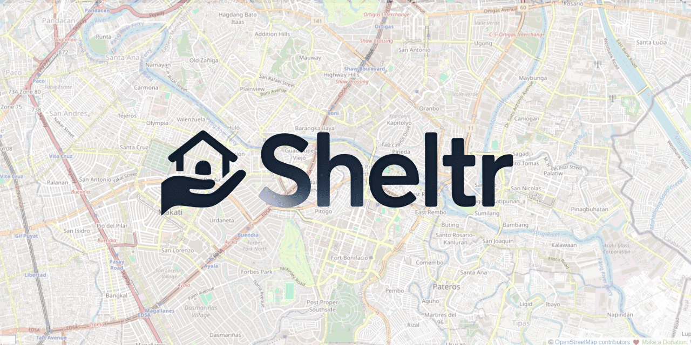
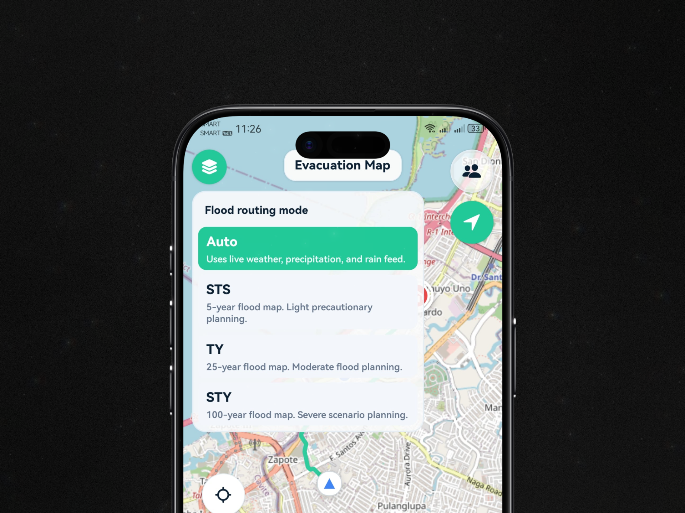
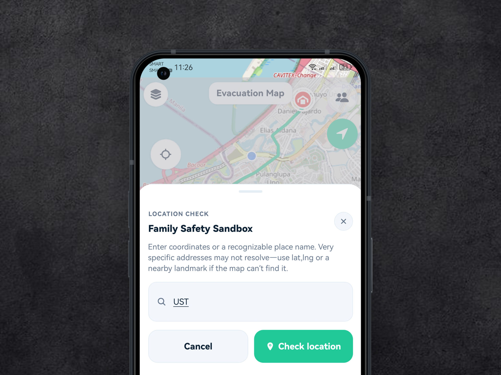

<p align="center">
  
</p>

# Sheltr
Sheltr is your flood-assistant for Metro Manila evacuation decisions. It focuses on safety-first routing when floods and storm surge turn ordinary streets into impassable segments.

## Project status: pre-planning
Sheltr is in a pre-planning phase. The system already exposes four scenario modes (auto, sts, typhoon, super_typhoon), but the product is not production-ready and should be treated as a planning and demonstration tool. Outputs are guidance, not guarantees. Always follow PAGASA and LGU directives.

## Why Sheltr?
Standard navigation tools such as Waze or Google Maps are not built for micro-topography, drainage bottlenecks, or real-time flood-depth hazards. A route can look normal on a road map yet be physically impassable due to water depth. Sheltr exists to overlay flood and storm-surge hazards on routing decisions so evacuees avoid segments that appear navigable but are unsafe in practice.

## Repository overview
Sheltr is a Metro Manila evacuation support system made up of an Expo app, a Flask API, and geospatial hazard data. The app requests routes and safety data from the API. The API selects a route, scores flood exposure, and returns safety guidance with nearby evacuation centers. The data folder contains flood and storm-surge GeoJSON layers and NCR river linework.

## Feature set
- **Hazard-aware routing** with Valhalla (Stadia) and a straight-line fallback when graph routing fails.
- **Flood and storm-surge overlays** rendered on the map for situational awareness.
- **Four scenario modes**: auto (weather-driven), sts, typhoon, super_typhoon.
- **Deterministic safety scoring** with flood risk, safety score, confidence score, and go/caution/no_go decision.
- **Evacuation center discovery** with nearest-center lookup and center photo support.
- **Weather and flood snapshot endpoints** powered by Open-Meteo.
- **Safety notifications** and templated advisories.
- **SOS session flow** for rescue signaling and claim tracking.
- **Route and home briefings** (optional) via OpenRouter when configured.
- **Rate limiting and caching** for stability under load.

## Scenario modes
| Mode | Purpose | Selection logic |
| --- | --- | --- |
| auto | Default, weather-driven selection | Chooses flood map and storm surge based on live rain and wind thresholds. |
| sts | Severe tropical storm scenario | Forces 5-year flood map and SSA1 storm-surge baseline. |
| typhoon | Typhoon scenario | Forces 25-year flood map and SSA3 storm-surge baseline. |
| super_typhoon | Super typhoon scenario | Forces 100-year flood map and SSA4 storm-surge baseline. |

## UI Samples


is the first screen users see. It is where users start a route check and select a hazard scenario before requesting guidance.


shows the light-theme preset view used for quick route checks in normal viewing conditions.


shows the same preset workflow in dark theme for low-light readability and visual comfort.

### Route output and decision support

shows route output, decision support cards, and summary guidance in light theme. This is where users interpret whether a route is safer, borderline, or unsafe.


shows the same route and guidance panel in dark theme to confirm parity across themes.

### Map evidence and local context

shows a zoomed route over hazard context in light theme so users can inspect where risk intersects the path.


shows detailed map inspection in light theme for local-area checking before movement.

## Cloud deployment notes (Railway free tier)
- Run one device at a time when testing the deployed app. The Railway free tier (512 MB) can hit OOM under heavier concurrent usage.
- If the cloud API errors out during testing, restart/reset and retry. Intermittent recovery can happen after reset on constrained memory.
- Area briefing may not always work in cloud deployment. It is currently the least prioritized modal and was intentionally deprioritized for memory management.

## Tech stack
- **Frontend**: React Native (Expo)
- **Backend**: Python (Flask)
- **Routing**: Valhalla via Stadia Maps
- **GIS tooling**: QGIS, Shapely, GeoJSON
- **Data store**: Supabase (PostgreSQL + PostGIS)

## Repository map (judge labels vs. repo folders)
| Judge label | Folder in this repo | Purpose |
| --- | --- | --- |
| api/ | backend/ | Flask API and hazard logic |
| app/ | frontend/ | Expo app |
| data/ | data/ | Flood, storm-surge, and river GeoJSON |
| scripts/ | repo root scripts | Local run helpers and batch files |

## Repository tree
```
.
├── backend/                 # api/
├── frontend/                # app/
├── data/
├── docs/
├── supabase/
├── run-backend-local.cmd
├── run-frontend-local.cmd
├── start-local-temp.bat
├── Dockerfile
└── package.json
```

## Routing and safety logic (summary)
Routing chooses a graph route from Valhalla when available, then samples that route against flood and storm-surge polygons. A deterministic policy converts overlap metrics into flood risk, safety score, confidence score, and a go/caution/no_go decision. The full list of parameters, weights, and thresholds is documented in **docs/POLICY.md**.

## Routing warning and low-confidence behavior
If graph routing fails, the API falls back to a straight-line route. This sets the confidence score to a low state because the route is not a validated road path. The UI shows a safety banner such as “No safer route found” to warn users that a safe, mapped route could not be calculated. In this state, users are instructed to wait for official guidance or move only when safe.

## Data layers and sources
Flood polygons are stored in `data/MetroManila_Flood_5year.json`, `data/MetroManila_Flood_25year.json`, and `data/MetroManila_Flood_100year.json`. Storm-surge polygons are stored in `data/MetroManila_StormSurge_SSA1.json` through `data/MetroManila_StormSurge_SSA4.json`. NCR river linework is stored in `data/NCR_Rivers_Clipped.json`.

## Calibration and ground truth
All hazard policy constants are calibrated exclusively to Typhoon Carina (July 2024), the only recent and clearly documented typhoon that produced significant Metro Manila flooding during this project’s timeframe. No other typhoon events or flood incidents were used to calibrate weights, thresholds, or labels.

## Evaluation methodology
Sample size: **N = 180** route samples.  
Class distribution: **90 passable** and **90 not passable**, categorized using policy-aligned decision labels: **go**, **caution**, and **no_go**.  
Ground truth: **Typhoon Carina historical hazard labels**.  
Label policy reference: decision thresholds and labels are defined in `docs/POLICY.md` under **Go, caution, and no_go decision thresholds**.  
Precision = TP / (TP + FP), reported as macro-average across `go`, `caution`, and `no_go`.  
Recall = TP / (TP + FN), reported as macro-average across `go`, `caution`, and `no_go`.  
Accuracy = correct predictions / N across the same three policy labels.  
Flip Rate measures prediction stability across sampling resolutions.

| Metric | Typhoon Scenario | Super Typhoon Scenario | Significance |
| --- | --- | --- | --- |
| Recall | 0.90 | 0.90 | Strong coverage across policy labels (`go`, `caution`, `no_go`) in Typhoon Carina labeled data. |
| Precision | 0.85 | 0.85 | Predictions remain specific across policy labels while limiting false alerts. |
| Accuracy | 0.85 | 0.84 | Overall correctness is measured over the same three policy labels. |
| Flip Rate (consistency of predictions) | 0.00 | 0.00 | No flips, or 0%, across different sampling resolutions (original computed value retained). |

## License and data ethics
Sheltr is released under the MIT License. See `LICENSE` for full terms.

Sheltr uses government and NOAH-derived hazard layers to guide evacuation decisions. These layers are used for safety planning only and are not a real-time inundation guarantee. Users must follow official advisories and local government instructions.
